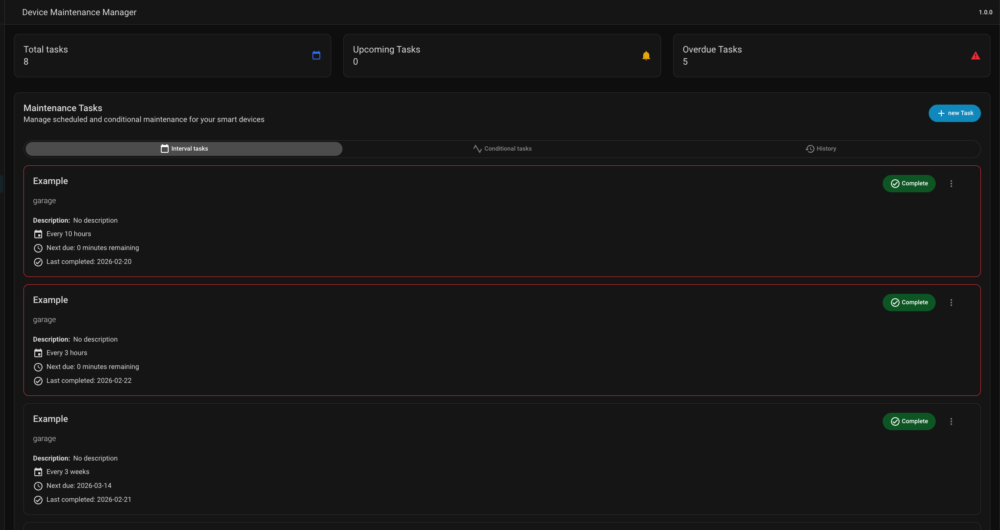
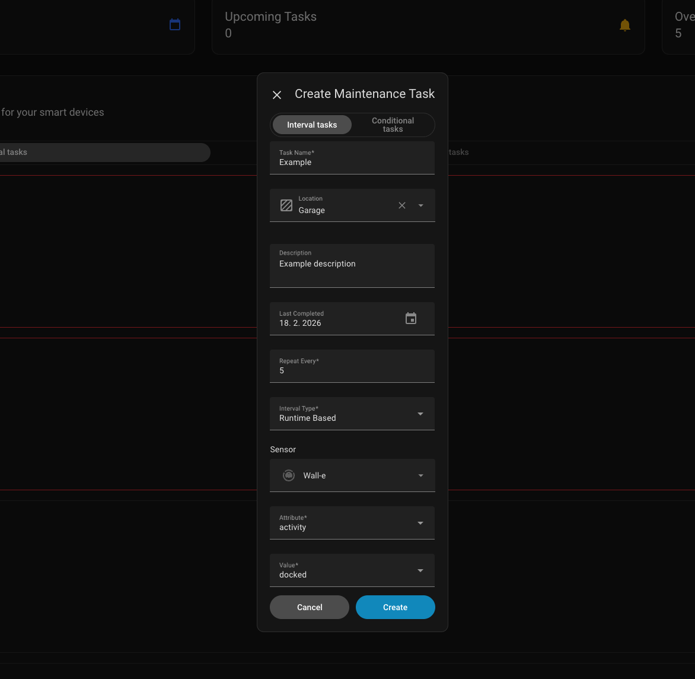
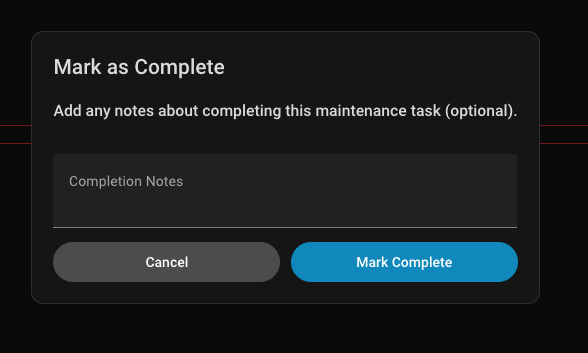

# Maintenance Manager for your smart home

This repository contains a solution and implementation for maintaining smart devices in the **Home Assistant** environment. The system allows planning, monitoring, and automating maintenance tasks, covering **regular tasks** at established intervals and **dynamic tasks** triggered by the actual conditions and states of smart devices. Part of the solution is notifications that alert users to upcoming or overdue tasks, a history of completed tasks, and an interface integrated directly into the Home Assistant environment.

---
## 📸 Overview

### Main Dashboard



---

### Creating a Task



---

### Completing a Task


---

## 📦 Installation

### Manual Installation

1. Ensure you have a Home Assistant installation (OS, Container, or Core).
2. In your Home Assistant configuration folder (the one containing `configuration.yaml`), create a folder called:

   ```
   custom_components/
   ```

3. Download or clone this repository and copy the folder:

   ```
   custom_components/maintenance_manager/
   ```

   into your Home Assistant config directory so the final path is:

   ```
   /config/custom_components/maintenance_manager/
   ```

4. Restart Home Assistant.
5. Go to **Settings → Devices & Services → Add Integration**.
6. Search for **Maintenance Manager** and complete the setup.

> ⚠️ Make sure the folder structure looks like this:
>
> ```
> config/
> └── custom_components/
>     └── maintenance_manager/
>         ├── __init__.py
>         ├── manifest.json
>         └── (...other files...)
> ```

---

## ⚙️ Configuration

After installation:

1. Go to **Settings → Devices & Services**.
2. Click **+ Add Integration**.
3. Search for **Maintenance Manager**.
4. Follow the UI prompts to configure your maintenance tasks.

This integration uses **config flow**, so no YAML configuration is required.

---

## 🧪 Troubleshooting

- If the integration does not appear after restart, verify:
  - The folder name matches the domain in `manifest.json`
  - The directory structure is correct
  - Home Assistant logs do not contain errors related to `maintenance_manager`

- If needed, fully restart Home Assistant instead of just reloading integrations.

---

## 🧠 How It Works

Maintenance Manager supports two main types of tasks:

- **Interval Tasks**
- **Conditional Tasks**

Each type determines how and when a task becomes due.

---

## 🔁 Interval Tasks

Interval tasks become due after a defined time period or usage runtime since their last completion.

### Fixed Interval

If **Fixed** is enabled, the interval is calculated based on the stored `next_due` date.

When the task is completed:

- The system takes the current `next_due` date.
- It adds the configured repeat interval (e.g., 30 days).
- A new `next_due` date is calculated.

This means the schedule is anchored to the previously planned due date,
not recalculated from the actual completion time.

Example:
- `next_due`: January 31
- Interval: 30 days  
- After completion, the new `next_due` becomes March 2 (31 + 30 days).

This ensures consistent long-term scheduling even if the task is completed earlier or later than planned.

---

### ⏱️ Runtime-Based Interval

An Interval Task can also be configured as **Runtime-Based**.

In this mode, you:

- Select a sensor
- Define a condition (for example: sensor state above a threshold)
- Define a total number of hours

How it works:

- Whenever the defined condition is true, runtime hours start counting.
- The system continuously subtracts the active runtime from the total configured hours.
- When the remaining runtime reaches **0 hours**, the task becomes **overdue**.

Example:
- Total runtime: 100 hours
- Condition: Power sensor > 0 W  
- Each hour the device is running reduces the remaining runtime.
- When 100 runtime hours are reached, maintenance becomes due.

This is ideal for maintenance based on actual device usage rather than calendar time.

---

## 📊 Conditional Tasks

Conditional tasks become due based on a monitored condition in Home Assistant.

### ⏱️ Condition Duration

**Condition duration** specifies how long a condition must remain true before the task becomes due.

Example:
- Condition: Humidity above 70%
- Condition duration: 48 hours  

The task becomes due only if the condition remains continuously active for the defined duration.

This is useful for threshold-based maintenance or environment-triggered servicing.

---

### 🌦 Seasonal Task

When a task is configured as **Seasonal**, it becomes inactive after completion
for the defined seasonal interval.

How it works:

- Once you press **Complete**, the task is disabled for the configured seasonal period.
- During this time, it cannot become due.
- After the seasonal interval expires, the task is automatically reactivated.
- From that moment, normal interval or condition tracking resumes.

This is useful for equipment that should only require maintenance once per season,
such as heating systems, air conditioning, or seasonal machinery.

---

## ✅ Completing a Task

When a task becomes due, you can mark it as completed by clicking the **Complete** button.

When completing a task:

- The due state is reset.
- Interval time or runtime counter resets.
- Condition tracking restarts.
- You can optionally add a **note** describing what was performed.

Each completion is stored in the task history.

---

## 📜 Task History

Each task maintains a history of completions.

In the **History** tab, you can see the most recent completion entry.

To view the full history (including previous completions and notes),
click on the task to open its detailed history view.

---

## 🔔 Notifications & Overdue Behavior

When a task becomes overdue, you will receive a notification.

If the task remains overdue:

- The next reminder will always be sent the following day at **09:00**.
- Daily reminders continue until the task is completed.

All time calculations respect the Home Assistant configured timezone.

---

## 🔄 Restart Behavior

After Home Assistant restarts:

- Task states are recalculated from stored data.
- Remaining runtime and intervals continue from their last saved state.
- No data is lost during restart.

---

## ⚙️ Home Assistant Dependency

This integration runs entirely inside Home Assistant.

If Home Assistant is turned off:

- No task evaluation occurs.
- No runtime is counted.
- No notifications are sent.

All logic depends on Home Assistant being active.